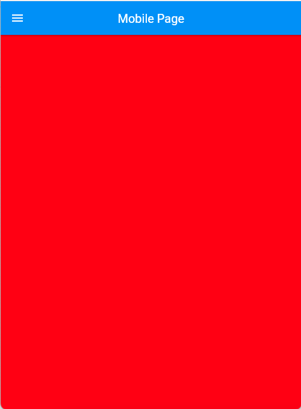
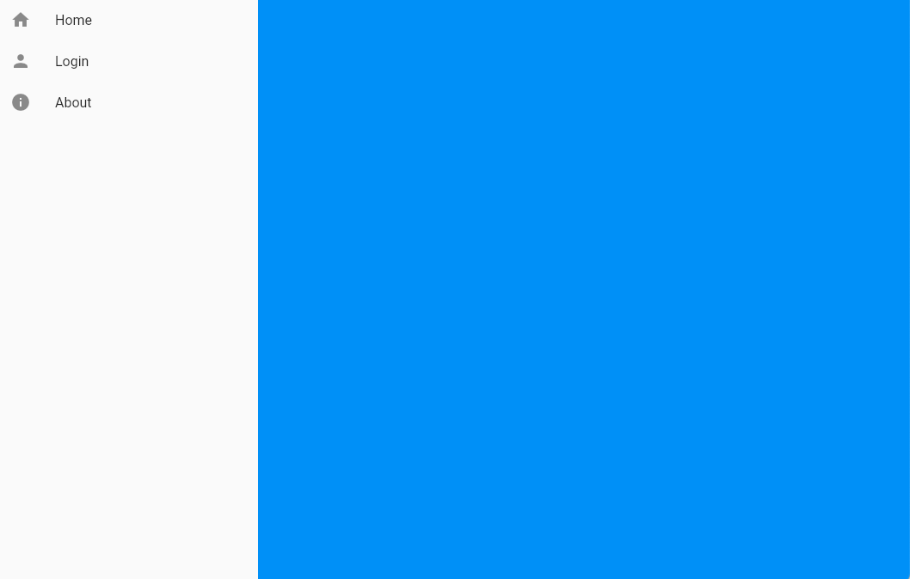
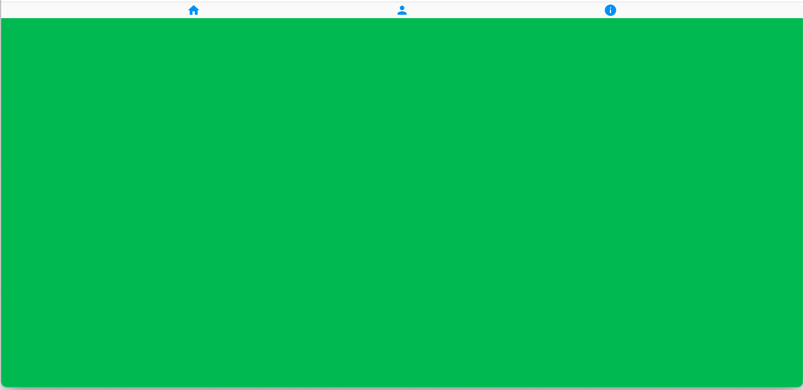

# Responsive Container

This Widget wraps layoutbuilder to provide a Responsive Container container.
It can be used to build layout for mobile, tablet and desktop.

* Mobile Widget is mandatory
* If tablet widget is missing it will render mobile widget
* If desktop widget is missing it will render tablet widget
* Default Min Width for tablet widget is 800 and for desktop widget is 1200


## Usage

To use this plugin, add responsiveui_container

## Example

```
import 'package:flutter/material.dart';
import 'package:responsiveui_container/responsiveui_container.dart';

void main() {
  runApp(MyApp());
}

class MyApp extends StatelessWidget {
  @override
  Widget build(BuildContext context) {
    return MaterialApp(
      debugShowCheckedModeBanner: false,
      title: 'Responsive Container Demo',
      theme: ThemeData(
        primarySwatch: Colors.blue,
      ),
      home: RContainer(
        mobile: MobileHomePage(),
        tablet: TabHomePage(),
        desktop: DesktopHomePage(),
      ),
    );
  }
}
```

## Mobile


## Tablet


## Desktop
